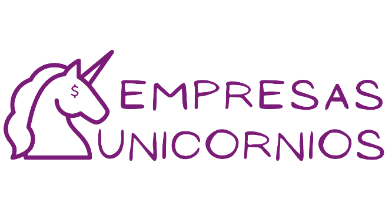

Aquí pueden ver mi trabajo final del Bootcamp de data analytycs que realicé en [Upgrade Hub](https://www.upgrade-hub.com/) 

# Presentación:
Las empresas unicornio son reconocidas por su capacidad para innovar y liderar en el ámbito tecnológico. Por lo que este proyecto se centra en analizar y comprender las empresas unicornios en el mundo. 

Para ver este proyecto les dejo aquí el enlace de la app que realicé con streamlir [Streamlit](https://unicornscompanies.streamlit.app/)

Navega por el menú y ve cada etapa del proyecto. 😉

## Dataset:
Para realizar este trabajo se recopilaron datos de una plataforma de análisis de negocios globales conocida como CB Insights.

